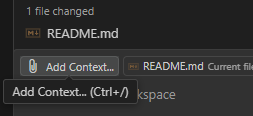
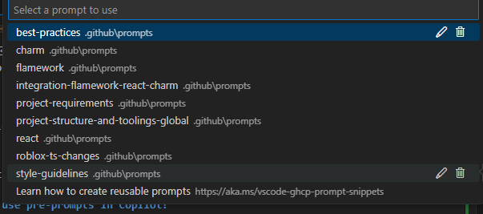
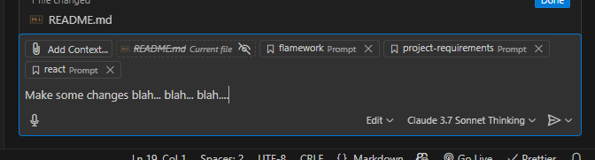

Collection of prompts that you can use to improve the AI answers in the project.

Included:

- roblox-ts basics, Feature-based separation, flamework, react, charm project

Contributions are welcome!

# How to use pre-prompts in Copilot?

To create a prompt put it in `.github/instructions` Folder and add `.instructions.md` extension

## In Copilot Window:

- Click on Add Context...

  

- Choose prompt

  

  

- Do a main prompt

  

## Recommendations:

- Prefer using Claude 3.7 Sonnet Thinking, because in my opinion it follows the prompt the best

- If the AI continues to make mistakes, consider creating a new chat to reset the context

- Prefer using Feature-Based separation [Flamework Template](https://github.com/Velover/TSFlameworkGameTemplate) as it provides a ready-to-use project structure.

### Feature-Based template

**Bun**

```console
bunx degit https://github.com/Velover/TSFlameworkGameTemplate#Features
bun i
```

**NPM**

```console
npx degit https://github.com/Velover/TSFlameworkGameTemplate#Features
npm i
```

### Roblox Ui Bible

Tools and guide to design multi-device ui (multi-platform-ui-design-bible.prompt.md)

https://github.com/Velover/RobloxUIBible
